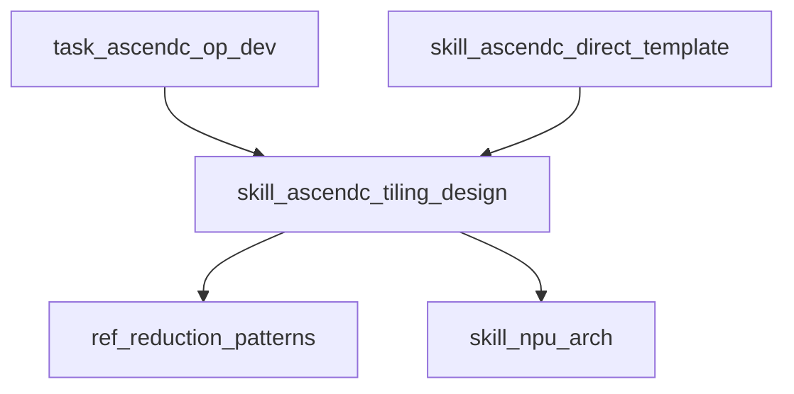

# CANNBot Skills 与 OKF / LLM-Wiki 融合方案

日期：2026-06-20

目标仓库：`https://gitcode.com/cann/cannbot-skills`

本方案基于本地克隆 `/tmp/cannbot-skills` 的阅读结果。已重点查看：

- `README.md`
- `AGENTS.md`
- `docs/STANDARDS.md`
- `docs/GOVERNANCE.md`
- `docs/skills-usage.md`
- `tests/unit/skills/test-structure.sh`
- `tests/unit/skills/test-content.sh`
- `tests/lib/skill_validator.py`
- `infra/cannbot-skill-reviewer/SKILL.md`
- `infra/gitcode-toolkit/SKILL.md`
- `ops/ascendc-tiling-design/SKILL.md`
- `model/model-infer-fusion/SKILL.md`
- `ops/npu-arch/SKILL.md`
- 多个 `plugins-official/*/.claude-plugin/plugin.json` 与 quickstart。

## 1. 结论

CANNBot Skills 非常适合引入 OKF / LLM-Wiki，原因是它已经具备四个前置条件：

1. **知识源已经结构化**：大量知识以 `SKILL.md`、`references/`、`scripts/`、`AGENTS.md`、`quickstart.md` 存在。
2. **渐进式披露已经是规范**：`SKILL.md` 放核心，细节放 references，这正是 LLM-Wiki 页面分层的基础。
3. **真源意识已经存在**：`docs/STANDARDS.md` 明确提出知识依赖单向性和真源 skill。
4. **测试门禁已经存在**：skill 结构、内容、链接、唯一性已有测试脚本，可扩展成 Wiki 门禁。

推荐路线：

- 不改现有 skill 加载机制。
- 不重写 109 个 `SKILL.md`。
- 不把 Wiki 当作唯一检索系统。
- 新增 `infra/cannbot-knowledge-wiki` 内部基础设施 skill，负责知识编译、索引、校验和 Error Book。
- 先做 4 个代表 skill 的 PoC，再扩大到全仓。

## 2. CANNBot 当前知识架构

### 2.1 仓库层级

当前仓库主要层级：

```text
cannbot-skills/
├── ops/                  # 算子相关正式 skill
├── ops-lab/              # 实验 skill
├── model/                # 模型推理优化 skill
├── graph/                # 图模式/torch.compile 相关 skill
├── infra/                # 基础设施和治理 skill
├── plugins-official/     # 官方插件
├── plugins-community/    # 社区插件
├── docs/                 # 规范和治理文档
└── tests/                # 结构、内容、行为、集成测试
```

### 2.2 Skill 类型

`docs/STANDARDS.md` 中已有分类：

- 知识库类。
- 工程模板类。
- 调试与测试类。
- 测试开发类。
- 工具辅助类。

OKF 可以把这些类型映射成 Wiki 页面：

| CANNBot 类型 | Wiki kind | 典型页面 |
|---|---|---|
| 知识库类 | `skill` + `concept` + `reference` | `npu-arch`, `ascendc-tiling-design` |
| 工程模板类 | `skill` + `template` + `workflow` | `ascendc-direct-invoke-template` |
| 调试与测试类 | `skill` + `error` + `workflow` | `ascendc-runtime-debug` |
| 测试开发类 | `skill` + `test` + `checklist` | `ascendc-st-design` |
| 工具辅助类 | `skill` + `script` | `ascendc-env-check` |
| 内部参考类 | `internal-reference` | `gitcode-toolkit` |

### 2.3 已有治理能力

已有能力：

- frontmatter 检查。
- description 触发条件检查。
- 链接检查。
- name 唯一性检查。
- `disable-model-invocation` 支持。
- `cannbot-skill-reviewer` 九维评分。
- `docs/GOVERNANCE.md` 管理 skill 入库流程。

OKF 不应替代这些能力，而应复用并扩展。

## 3. 融合目标

### 3.1 用户目标

用户提出问题时，agent 能更快判断：

- 应使用哪个 skill。
- 是否需要多个 skill 组合。
- 先读哪个 `SKILL.md`。
- 哪些 references 必须读。
- 哪些硬结论需要回到真源验证。
- 当前问题是否需要工具/脚本/硬件实测。

### 3.2 维护者目标

维护者希望：

- 看清 skill 之间的依赖关系。
- 找出重复真源和知识漂移。
- 找出断链、过长页面、误触发 description。
- 知道新增 skill 会影响哪些页面。
- 能在 PR 中看到知识图谱和 Error Book 变化。

### 3.3 Agent 目标

Agent 需要：

- 一个稳定的 `wiki_search` 入口。
- 可以按 section 读取页面。
- 可以沿 related pages 找到上游真源。
- 可以报告“知识不足”而不是编造。
- 可以用 Error Book 沉淀失败。

## 4. 推荐新增模块

### 4.1 目录结构

建议新增：

```text
infra/cannbot-knowledge-wiki/
├── SKILL.md
├── references/
│   ├── page-schema.md
│   ├── compile-policy.md
│   ├── source-of-truth-policy.md
│   ├── error-book-taxonomy.md
│   ├── agent-usage-guide.md
│   └── rollout-plan.md
├── scripts/
│   ├── build_wiki.py
│   ├── validate_wiki.py
│   ├── search_wiki.py
│   ├── render_graph.py
│   └── collect_eval_cases.py
└── examples/
    ├── wiki/
    └── eval/
```

可选生成产物：

```text
wiki/
├── _index.md
├── _graph.json
├── _search.jsonl
├── _claims.jsonl
├── _sources.jsonl
├── _error_book.yaml
├── skills/
├── references/
├── tasks/
├── concepts/
├── workflows/
├── plugins/
└── agents/
```

### 4.2 `SKILL.md` 草案

```markdown
---
name: cannbot-knowledge-wiki
description: CANNBot 知识 Wiki 编译与治理内部参考。提供 SKILL.md、references、agents、plugins、tests 的知识索引、真源关系、断链检查、Error Book 和检索入口；供维护者在新增/修改 skill、排查知识漂移、生成知识图谱、评估 agent 检索效果时使用，本 skill 不直接响应普通用户任务。
disable-model-invocation: true
license: CANN-2.0
---

# CANNBot Knowledge Wiki

内部基础设施 skill：把 CANNBot Skills 仓库编译为 agent 可读、可检索、可验证、可演化的 Markdown Wiki。

## 定位

- 不替代现有 skill。
- 不替代原始 references。
- 不作为技术事实真源。
- 负责索引、导航、真源映射、错误账本和治理检查。

## 工作流

1. 运行 `scripts/build_wiki.py` 扫描仓库。
2. 生成 Wiki 页面、索引、source map 和 graph。
3. 运行 `scripts/validate_wiki.py` 检查断链、缺 source、重复真源、页面过长。
4. 将问题写入 `_error_book.yaml`。
5. 维护者根据 Error Book 修复源文件或编译规则。

## 参考资料

- `references/page-schema.md`
- `references/compile-policy.md`
- `references/source-of-truth-policy.md`
- `references/error-book-taxonomy.md`
- `references/agent-usage-guide.md`
```

### 4.3 为什么放在 `infra/`

原因：

- 它是基础设施和治理能力，不是某个 CANN 技术任务。
- 类似 `cannbot-skill-reviewer`、`gitcode-toolkit`。
- 可被其他 skill、agent、plugin 复用。
- 适合接入 CI。

## 5. 页面 schema 设计

### 5.1 Skill 页面

示例：

```yaml
---
id: skill.ascendc-tiling-design
kind: skill
title: AscendC Tiling Design
source:
  path: ops/ascendc-tiling-design/SKILL.md
  commit: <git-sha>
domain: ops
category: knowledge
status: active
invocation: model-triggered
tags:
  - ascendc
  - tiling
  - buffer
  - multicore
related_tasks:
  - task.ascendc-op-design
  - task.ascendc-op-development
source_of_truth_for:
  - concept.tiling-strategy
depends_on:
  - skill.npu-arch
references:
  - ops/ascendc-tiling-design/references/reduction/patterns.md
  - ops/ascendc-tiling-design/references/matmul/patterns.md
validation:
  - tests/unit/skills/test-structure.sh
  - tests/unit/skills/test-content.sh
---
```

正文：

```markdown
# AscendC Tiling Design

## Summary

Ascend C 算子 Tiling 设计指南，覆盖算子分类、多核切分、UB 切分、Buffer 规划和分支覆盖。

## When To Use

- 设计 Ascend C 算子 tiling 策略。
- 分析多核切分、UB 容量、Buffer 规划。
- 查找某类算子的 tiling 方法论。

## Must Read First

- Reduction：`references/reduction/patterns.md`
- MatMul：`references/matmul/patterns.md`
- FlashAttention：`references/flashattention/overview.md`

## Source Of Truth

- 本 skill 是 tiling 方法论入口。
- 硬件参数应回到 `npu-arch` 或 CANN 平台配置验证。

## Risks

- 不同 NPU 架构参数不同，不能硬编码。
- references 中的路径和示例可能随仓库演进漂移。
```

### 5.2 Reference 页面

```yaml
---
id: reference.ascendc-tiling-design.matmul-patterns
kind: reference
title: AscendC MatMul Tiling Patterns
source:
  path: ops/ascendc-tiling-design/references/matmul/patterns.md
parent: skill.ascendc-tiling-design
tags:
  - matmul
  - tiling
  - cube
claims_policy: source-required
---
```

### 5.3 Task 页面

任务页面不是原始文件的简单镜像，而是为 agent 提供路线图。

示例：`task.ascendc-op-development`

```markdown
# AscendC 算子开发任务路线

## Intent

用户要从需求开始开发或迁移 AscendC 算子。

## Skill Route

1. `ascendc-env-check`：确认环境。
2. `npu-arch`：确认平台和硬件参数。
3. `ascendc-tiling-design`：设计 tiling。
4. `ascendc-direct-invoke-template` 或 `ascendc-registry-invoke-template`：选择工程模板。
5. `ascendc-precision-debug`：精度异常时排查。
6. `ascendc-runtime-debug` / `ascendc-crash-debug`：运行异常时排查。
7. `ascendc-code-review`：提交前检视。

## Stop Conditions

- 用户未提供源码路径。
- 平台版本不明确。
- 需要 NPU 实测但当前环境无 NPU。
```

### 5.4 Concept 页面

示例：`concept.source-of-truth-skill`

```markdown
# 真源 Skill

真源 skill 是某领域知识的唯一上游维护位置。下游 skill 可以引用真源，但不应复制后自行维护。

## Why

避免知识漂移。比如 NPU 硬件参数应集中在 `npu-arch`，其他 skill 只引用。

## Validation

- 检查重复表格。
- 检查相同 claim 是否在多个 skill 出现。
- 检查下游是否链接上游。
```

## 6. 编译器功能设计

### 6.1 `build_wiki.py`

职责：

- 扫描仓库。
- 解析文件。
- 生成页面。
- 生成索引和图。
- 输出 Error Book 初稿。

命令：

```bash
python infra/cannbot-knowledge-wiki/scripts/build_wiki.py \
  --repo-root . \
  --out wiki \
  --scope all
```

PoC 命令：

```bash
python infra/cannbot-knowledge-wiki/scripts/build_wiki.py \
  --repo-root . \
  --out /tmp/cannbot-wiki-poc \
  --include ops/ascendc-tiling-design \
  --include model/model-infer-fusion \
  --include infra/cannbot-skill-reviewer \
  --include infra/gitcode-toolkit
```

输出：

```text
Build summary
- scanned_skills: 4
- generated_pages: 18
- broken_links: 0
- missing_sources: 2
- warnings: 5
```

### 6.2 `validate_wiki.py`

职责：

- 检查 Wiki 产物质量。
- 输出 JSON 或 Markdown 报告。
- 可接入 CI。

规则：

| Rule | Level | 含义 |
|---|---|---|
| WIKI-STR-01 | error | 页面缺 frontmatter |
| WIKI-STR-02 | error | 页面缺 id/kind/title/source |
| WIKI-STR-03 | error | source.path 不存在 |
| WIKI-STR-04 | error | Markdown 链接断裂 |
| WIKI-CON-01 | warn | 页面超过建议长度 |
| WIKI-CON-02 | warn | skill 页面无 When To Use |
| WIKI-CON-03 | warn | 硬结论缺 source |
| WIKI-GOV-01 | error | 检测到 token/密码疑似泄露 |
| WIKI-GOV-02 | warn | 可能存在真源漂移 |
| WIKI-GOV-03 | warn | internal-reference 未设置 disable-model-invocation |

命令：

```bash
python infra/cannbot-knowledge-wiki/scripts/validate_wiki.py wiki
python infra/cannbot-knowledge-wiki/scripts/validate_wiki.py wiki --json
```

### 6.3 `search_wiki.py`

职责：

- 本地检索 Wiki 页面。
- 先实现 BM25/关键词，不急于引入向量库。

命令：

```bash
python infra/cannbot-knowledge-wiki/scripts/search_wiki.py \
  --index wiki/_search.jsonl \
  "matmul tiling UB 切分"
```

输出：

```text
1. skill.ascendc-tiling-design
   score: 18.2
   path: wiki/skills/ascendc-tiling-design.md
   why: title/tag/summary match

2. reference.ascendc-tiling-design.matmul-patterns
   score: 14.7
   path: wiki/references/ascendc-tiling-design/matmul-patterns.md
   why: content match
```

### 6.4 `render_graph.py`

职责：

- 从 `_graph.json` 输出 Mermaid 或 DOT。
- 用于 PR 审查。

输出示例：



### 6.5 `collect_eval_cases.py`

职责：

- 从 `docs/skills-usage.md`、README 示例、behavior test cases 中提取评测问题。
- 生成人工可审查的 eval YAML。

输出：

```yaml
- id: eval.skill.001
  question: "帮我设计 Add 算子的 tiling"
  expected_route:
    - skill.ascendc-tiling-design
    - skill.ascendc-direct-invoke-template
  source: docs/skills-usage.md
```

## 7. Agent 使用协议

### 7.1 普通用户任务

当用户提出 CANNBot 任务时：

1. 如果明确点名 skill，先读该 skill。
2. 如果未明确点名，先 `wiki_search` 找 task 或 skill。
3. 读 skill 页面确认适用条件。
4. 读原始 `SKILL.md`。
5. 按需读 references。
6. 对硬件/API/版本结论回到 source。
7. 输出时说明使用了哪些 skill 和证据。

### 7.2 维护任务

当维护者修改 skill：

1. 运行现有 skill 测试。
2. 运行 Wiki 编译。
3. 查看 Error Book diff。
4. 查看 graph diff。
5. 修复断链或补 source。
6. 再提交。

### 7.3 失败处理

Agent 遇到以下情况必须停止或标记：

- 找不到真源。
- 页面和 source 冲突。
- 需要 NPU 实测但无法运行。
- API 行为不是文档明确支持。
- Wiki 摘要与原文不一致。

记录到 Error Book：

```yaml
- type: wiki_source_conflict
  page: skills/model-infer-fusion.md
  source: model/model-infer-fusion/SKILL.md
  evidence: "Wiki summary says X, source says Y"
  action: "regenerate page and add regression case"
```

## 8. 与现有测试体系融合

### 8.1 不改现有测试

保留：

- `tests/unit/skills/test-structure.sh`
- `tests/unit/skills/test-content.sh`
- `tests/unit/test-dependency-graph.sh`
- `tests/run-tests.sh`

新增：

```text
tests/unit/wiki/test-wiki-structure.sh
tests/unit/wiki/test-wiki-links.sh
tests/unit/wiki/test-wiki-source-map.sh
tests/unit/wiki/test-wiki-error-book.sh
```

### 8.2 测试脚本草案

```bash
#!/usr/bin/env bash
set -euo pipefail

python infra/cannbot-knowledge-wiki/scripts/build_wiki.py \
  --repo-root . \
  --out /tmp/cannbot-wiki-test \
  --scope poc

python infra/cannbot-knowledge-wiki/scripts/validate_wiki.py \
  /tmp/cannbot-wiki-test \
  --fail-on error
```

### 8.3 CI 策略

阶段性策略：

| 阶段 | CI 行为 |
|---|---|
| PoC | 只跑 4 个示例 skill，error 阻塞 |
| Beta | 全仓编译，error 阻塞，warn 不阻塞 |
| Stable | 全仓编译，关键 warn 可配置阻塞 |

## 9. Rollout 计划

### 9.1 PR-1：设计文档和内部 skill

范围：

- 新增 `infra/cannbot-knowledge-wiki/SKILL.md`。
- 新增 `references/page-schema.md`。
- 新增 `references/compile-policy.md`。
- 新增 `references/error-book-taxonomy.md`。
- 不提交生成 Wiki。

验收：

- 通过现有 skill 结构和内容测试。
- `disable-model-invocation: true`。
- 文档不含无来源 CANN 技术结论。

### 9.2 PR-2：PoC 编译器

范围：

- 新增 `build_wiki.py`。
- 新增 `validate_wiki.py`。
- 支持 4 个示例 skill。
- 输出 `/tmp` 或 `examples/wiki`。

验收：

- 4 个 skill 页面可生成。
- 链接检查通过。
- Error Book 能输出至少 3 类 warn。

### 9.3 PR-3：搜索和 Agent 使用协议

范围：

- 新增 `search_wiki.py`。
- 新增 `references/agent-usage-guide.md`。
- 在一个 plugin quickstart 中示范如何使用。

验收：

- 10 个测试 query top-3 命中正确页面。
- 回答时能回到原始 source。

### 9.4 PR-4：全仓编译和 CI warn

范围：

- 扫描全部 `SKILL.md`。
- 生成 graph。
- CI 中非阻塞运行。

验收：

- 不显著拖慢 CI。
- Error Book 可读。
- 维护者能接受报告格式。

### 9.5 PR-5：评测闭环

范围：

- 从 `docs/skills-usage.md` 和 behavior tests 生成 eval cases。
- 记录查询成功率。
- 对编译器变更做回归。

验收：

- 有 baseline。
- PR 中能看到检索指标变化。

## 10. PoC 示例范围

建议选 4 类代表：

### 10.1 `ops/ascendc-tiling-design`

代表知识库类 skill。

要验证：

- 多 reference 层级。
- 算子分类表。
- 上游硬件参数真源。
- 不同 task 路由。

### 10.2 `model/model-infer-fusion`

代表复杂工作流 skill。

要验证：

- Attention/MoE 决策树。
- references 多文档。
- 脚本 `torch_npu_query.py`。
- API 文档查询和可信源要求。

### 10.3 `infra/cannbot-skill-reviewer`

代表治理 skill。

要验证：

- 测试命令。
- 九维评分。
- 入库结论。
- 与 OKF validate 关系。

### 10.4 `infra/gitcode-toolkit`

代表 internal reference。

要验证：

- `disable-model-invocation: true`。
- 被其他 skill 消费。
- 大文档分段。
- token 安全规则。

## 11. CANNBot 专属 Error Book 设计

### 11.1 错误类型

```yaml
types:
  broken_markdown_link:
    severity: error
    owner: source file owner
  missing_source_path:
    severity: error
  duplicated_source_of_truth:
    severity: warn
  skill_description_overbroad:
    severity: warn
  internal_skill_invocable:
    severity: error
  reference_too_deep:
    severity: warn
  hardware_claim_without_npu_arch:
    severity: warn
  api_claim_without_official_or_local_doc:
    severity: warn
  generated_summary_drift:
    severity: error
  sensitive_token_pattern:
    severity: error
```

### 11.2 示例

```yaml
- id: CBWIKI-0001
  status: open
  severity: warn
  type: hardware_claim_without_npu_arch
  page: wiki/skills/ascendc-tiling-design.md
  source:
    path: ops/ascendc-tiling-design/SKILL.md
  claim: "DAV_3510 UB 容量为 248KB"
  evidence: "当前页面未链接 npu-arch 真源"
  suggested_fix: "将硬件参数改为引用 ops/npu-arch/references/npu-hardware-params.md 或 CANN 平台配置"
```

## 12. 权限和安全策略

### 12.1 公开仓库约束

如果 `cannbot-skills` 是公开或半公开仓库：

- 不收录用户本地路径。
- 不收录 token。
- 不收录内部工单详情。
- 不收录无法公开授权的外部文档全文。

### 12.2 Script 扫描

对 `scripts/` 只生成：

- 脚本用途。
- 入口参数。
- 依赖命令。
- 风险提示。

不要把脚本运行结果或环境变量写入 Wiki。

### 12.3 外部来源

外部来源进入 Wiki 必须记录：

- URL。
- 抓取日期。
- 许可证或使用限制。
- 是否官方来源。

## 13. 与插件系统融合

### 13.1 插件页面

每个 `plugins-official/*` 可生成 plugin 页面：

```yaml
id: plugin.ops-direct-invoke
kind: plugin
source:
  path: plugins-official/ops-direct-invoke/.claude-plugin/plugin.json
quickstart: plugins-official/ops-direct-invoke/quickstart.md
agents:
  - plugins-official/ops-direct-invoke/agents/...
skills:
  - skill.ascendc-env-check
  - skill.ascendc-tiling-design
```

### 13.2 安装后使用

插件安装后可以附带一个轻量索引：

```text
.claude/skills/
.claude/agents/
.cannbot/wiki/_index.md
.cannbot/wiki/_search.jsonl
```

但初期不建议改变安装脚本，避免扩大风险。

## 14. 与 `cannbot-skill-reviewer` 的关系

`cannbot-skill-reviewer` 负责审查候选 skill 是否合格。

`cannbot-knowledge-wiki` 负责知识编译和治理。

二者关系：

```text
新增/修改 skill
  -> cannbot-skill-reviewer 审查 skill 本身
  -> cannbot-knowledge-wiki 检查知识图谱和 Wiki 影响
```

可复用 reviewer 的评分维度：

- Frontmatter 质量。
- 工作流清晰度。
- 边界条件覆盖。
- 检查点设计。
- 指令具体性。
- 资源整合度。
- 架构适配性。
- 可信度和安全边界。
- 验证证据。

OKF 可以把这些维度映射到页面质量。

## 15. 与真源治理融合

### 15.1 真源声明

建议在 Wiki 层而不是所有 skill 里一次性强制加字段。先自动推断：

- `npu-arch` 是硬件参数真源。
- `gitcode-toolkit` 是 GitCode 操作真源。
- `cannbot-skill-reviewer` 是 skill 审查真源。
- `ascendc-tiling-design` 是 tiling 方法论入口真源。

后续逐步在 `SKILL.md` frontmatter 中增加可选字段：

```yaml
source-of-truth-for:
  - npu-hardware-params
  - ascendc-tiling-methodology
```

### 15.2 漂移检测

检测方式：

- 相同表格标题重复出现。
- 相同 API 名和不同约束重复出现。
- 相同硬件参数在多个文件出现。
- 下游页面没有链接上游真源。

输出：

```text
Possible source drift:
- claim: UB capacity for DAV_3510
- sources:
  - ops/ascendc-tiling-design/SKILL.md
  - ops/npu-arch/references/npu-hardware-params.md
- action: verify and make npu-arch the single source
```

## 16. 评测方案

### 16.1 检索 benchmark

从真实使用样例生成：

```yaml
- id: q-ops-001
  question: "帮我开发一个 Abs 算子，输入 float16，输出 float16"
  expected_route:
    - skill.ascendc-env-check
    - skill.ascendc-tiling-design
    - skill.ascendc-direct-invoke-template
    - skill.ascendc-st-design
```

### 16.2 维护 benchmark

```yaml
- id: q-infra-001
  question: "新增一个 skill 前需要过哪些门禁？"
  expected_pages:
    - skill.cannbot-skill-reviewer
    - docs.STANDARDS
    - tests.unit.skills.structure
    - tests.unit.skills.content
```

### 16.3 API/硬件 benchmark

```yaml
- id: q-source-001
  question: "某个 NPU 架构参数应该在哪里更新？"
  expected_pages:
    - skill.npu-arch
    - concept.source-of-truth-skill
```

### 16.4 指标

- route accuracy。
- source citation accuracy。
- top-k page hit。
- missing source count。
- broken link count。
- regression count。

## 17. 工程排期

### 17.1 两周 PoC

第 1-2 天：

- 合入设计文档。
- 确定页面 schema。
- 确定 PoC 范围。

第 3-5 天：

- 实现扫描和解析。
- 生成 skill 页面。
- 生成 `_index.md`。

第 6-7 天：

- 实现链接检查和 Error Book。
- 对 4 个 skill 跑通。

第 8-10 天：

- 实现本地搜索。
- 写 20 个 eval query。

第 11-14 天：

- 接入非阻塞 CI。
- 输出 PoC 报告。
- 评审是否扩大范围。

### 17.2 一个月 Beta

- 覆盖全部 `SKILL.md`。
- 覆盖 plugin 页面。
- 覆盖 agent 页面。
- 建立 graph diff。
- 建立 benchmark baseline。

### 17.3 三个月稳定版

- claim 级 citation。
- source drift 自动检测。
- Error Book owner/SLA。
- 与 skill reviewer 联动。
- 可选向量索引。

## 18. 验收标准

PoC 通过标准：

- 4 个代表 skill 生成页面。
- 所有页面有 source。
- 所有相对链接可校验。
- Error Book 可读。
- 10 个查询 top-3 命中率不低于 80%。
- 不影响现有测试。

Beta 通过标准：

- 全仓 skill 页面生成成功。
- broken links 为 0 或全部进入 Error Book。
- 内部参考 skill 正确标记。
- 至少识别 5 类跨 skill 关系。
- PR 审查能看到 Wiki 影响报告。

稳定版通过标准：

- route accuracy 稳定提升。
- 新贡献者定位 skill 时间下降。
- 真源漂移问题减少。
- Agent 回答引用质量提升。
- Error Book 能闭环处理。

## 19. 关键决策点

### 19.1 生成产物是否提交

建议：

- PoC：提交 `examples/wiki`。
- Beta：CI artifact，不提交全量。
- Stable：如果页面体积可控，可提交 `docs/wiki`；否则只提交索引摘要。

### 19.2 是否使用向量库

建议：

- 第一阶段不用。
- 先用标题、标签、BM25、路径。
- 当 query 表明语义召回不足时，再引入 embeddings。

### 19.3 是否让 LLM 自动改写页面

建议：

- LLM 只生成建议和摘要。
- 事实必须来自 source。
- 关键页面需要 reviewer。

### 19.4 是否修改 `SKILL.md` schema

建议：

- 初期不改。
- 通过 Wiki 层推断。
- 稳定后再新增可选字段，如 `source-of-truth-for`、`depends-on`。

## 20. 最小可执行任务清单

1. 新建 `infra/cannbot-knowledge-wiki/SKILL.md`。
2. 新建 `references/page-schema.md`。
3. 新建 `references/compile-policy.md`。
4. 新建 `references/error-book-taxonomy.md`。
5. 实现 `build_wiki.py --scope poc`。
6. 实现 `validate_wiki.py`。
7. 为 4 个 PoC skill 生成页面。
8. 写 20 个 eval query。
9. 接入非阻塞 CI。
10. 用 `cannbot-skill-reviewer` 审查新 skill。

## 21. 最终建议

对 CANNBot 来说，OKF / LLM-Wiki 的价值不在“多一个文档站”，而在把 skill 仓库变成可治理的知识系统。正确的融合方式是：保留现有 skill 作为执行入口，保留 references 作为详细真源，用 Wiki 建立跨 skill 的导航、真源、证据、错误账本和评测闭环。这样既不破坏现有生态，又能显著提升 agent 在复杂 CANN 开发任务中的可解释性和稳定性。
